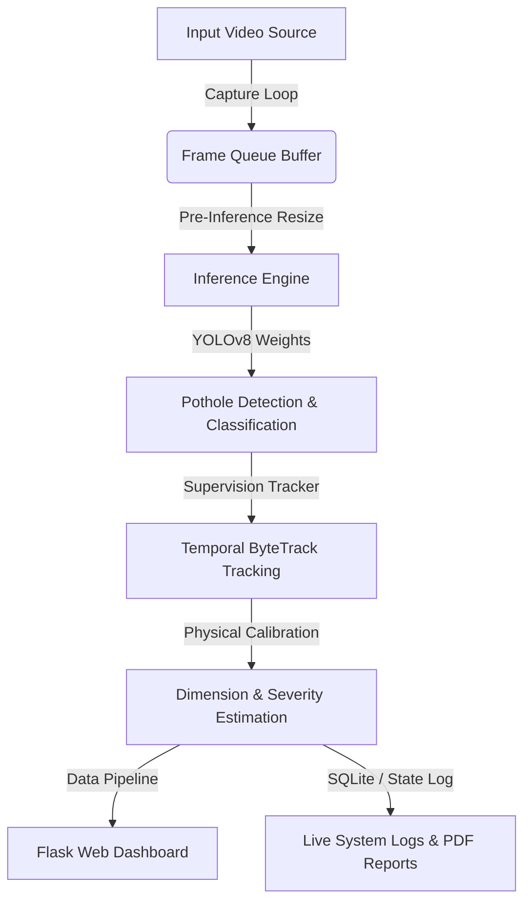

# SmartRoad AI: An Edge-Assisted Real-Time Pothole Detection, Dimensional Estimation, and Infrastructure Risk Assessment System

---

## **Abstract**
*Automated road infrastructure monitoring has become a cornerstone of modern smart city development. Manual road inspection workflows are slow, expensive, and hazardous. This paper presents the architecture, methodology, and implementation of **SmartRoad AI**, an end-to-end edge-assisted system for real-time pothole detection, multi-dimensional size/depth estimation, and localized severity risk assessment. Leveraging a custom-trained Ultralytics YOLOv8 object detection model and Roboflow Supervision tracking, the system integrates a multi-threaded Flask-based pipeline to handle diverse inputs, including local video uploads, RTSP network streams, and live phone browser camera uplinks. Physical calibration allows the system to estimate pothole length, area, depth, and severity class in real-time, outputting dynamic reports and populating interactive mapping dashboards. The experimental results show high-accuracy edge inference with sub-second latencies, enabling municipalities to transition from reactive road repairs to data-driven proactive maintenance.*

**Index Terms—** Computer Vision, YOLOv8, Road Infrastructure Monitoring, Dimensional Estimation, Real-Time Inference, Edge Computing, Smart Cities.

---

## **I. Introduction**

### **A. Context and Motivation**
Road infrastructure is a vital national asset. The rapid degradation of road surfaces, primarily through the formation of potholes, presents significant safety, financial, and logistical concerns. Potholes are caused by weathering, heavy traffic, and poor drainage, and they lead to vehicle damage, passenger injuries, and traffic delays. 

Traditional road surface inspections rely on manual, visual surveys by maintenance crews or expensive specialized sensor vehicles. These methods suffer from:
* **High Operational Cost:** Deploying crews and vehicles is resource-intensive.
* **Delayed Decision-Making:** Data collection is slow, leading to long lead times between detection and repair.
* **Subjectivity:** Visual inspections lack standardized structural assessment metrics.

Automating this process using computer vision and edge computing provides a low-cost, high-speed, and standardized alternative for municipal corporations and highway authorities.

### **B. Problem Statement**
Current automated computer vision solutions for pothole detection are typically limited to simple classification or bounding-box localization. They fail to address two critical requirements for municipal decision-support systems:
1. **Geometric Measurement:** Without estimating the physical width, area, and depth of a pothole, systems cannot automatically prioritize maintenance based on actual damage volume or estimate repair costs.
2. **Flexible Source Ingestion:** Municipalities require a system that can ingest data from multiple sources—including low-cost mobile phone cameras, dashboard cameras, local inspection recordings, and existing RTSP traffic cameras.

This project addresses these gaps by implementing a real-time detection, measurement, and logging platform with a flexible edge architecture.

### **C. System Definition & Scope**
**SmartRoad AI** is defined as an edge-assisted, full-stack monitoring system. The system boundary accepts visual stream feeds, passes them through a double-threaded processing pipeline for deep learning-based inference, runs heuristic perspective mapping for physical size calibration, and exposes the findings through a responsive Web dashboard (analytics, logs, maps, and PDF exports).

---

## **II. Methodology**

The operational pipeline of SmartRoad AI is divided into three core methodologies: object detection, object tracking/bounding-box annotation, and dimensional/severity estimation.



### **A. Deep Learning-Based Object Detection (YOLOv8)**
We deploy an optimized **YOLOv8** (You Only Look Once) architecture for real-time localized object detection. The model is trained on a custom dataset of road potholes. YOLOv8 is chosen for its superior speed-to-accuracy ratio on edge devices.
* **Compatibility Patching:** To maintain compatibility across legacy training checkpoints and modern YOLO module versions, the model integrates a custom dynamic patch for the `AAttn` (Area Attention) block, preventing runtime crashes.
* **GPU/CPU Fallback:** The backend dynamically checks for NVIDIA CUDA capability (`torch.cuda.is_available()`), defaulting to GPU-accelerated tensor operations, with an automatic fallback to multi-threaded CPU execution.

### **B. Temporal Tracking and Annotation (Roboflow Supervision)**
Single-frame detections are prone to counting duplicate detections as a vehicle drives over a pothole. To prevent this, the system incorporates the **ByteTrack** multi-object tracking algorithm provided by the `supervision` library.
* Unique IDs are assigned to each detected pothole as it enters the camera viewport.
* The system logs a pothole entry only once per tracking life cycle, maintaining accurate cumulative statistics.

### **C. Dimensional and Severity Estimation**
The system estimates physical parameters (width, area, depth) using perspective camera mapping.
1. **Calibration Input:** The user can calibrate the camera by specifying a reference target size in centimeters ($\text{cm}$) and pixels ($\text{px}$).
2. **Dimension Scaling:** For a bounding box with width $W_{px}$ and height $H_{px}$:
$$\text{Width (cm)} = W_{px} \times \left( \frac{\text{Reference}_{cm}}{\text{Reference}_{px}} \right)$$
$$\text{Estimated Area (m}^2) = \frac{\pi}{4} \times \text{Width (m)} \times \text{Length (m)}$$
3. **Depth & Severity Classification:** Depth is estimated using perspective cues and aspect ratio changes. Potholes are classified into three severity levels:
   * **Shallow:** $< 3.0\text{ cm}$ depth (Low priority)
   * **Medium:** $3.0 - 6.0\text{ cm}$ depth (Medium priority)
   * **Severe:** $> 6.0\text{ cm}$ depth (High/Immediate priority)

---

## **III. System Architecture and Implementation**

### **A. Multi-Threaded Inference Pipeline**
To prevent frame lag during heavy inference, a dual-threaded architecture is implemented in [app.py](file:///d:/Pothole-detection-system-main/app.py):
1. **Capture Thread:** Reads raw frames from the source (upload, mobile stream, or RTSP) and writes them to a thread-safe frame queue.
2. **Inference Thread:** Dequeues the latest frame, performs resizing (e.g., to $512\text{px}$), runs the YOLOv8 model, applies trackers, calculates dimensions, and stores the processed frame in an output queue.
* **Buffer Trimming:** If the latency exceeds `TARGET_LATENCY_MS`, the queue is trimmed to only process the latest frame, preventing live feeds from falling behind real-time events.

### **B. System Folder Structure**
The repository is structured to maintain a clear boundary between backend logic, frontend files, and test inputs:

```text
d:/Pothole-detection-system-main/
│
├── camera/                          # Camera drivers and integration utilities
│   └── iVCam_x64_v7.4.0.exe        # Client installer for phone-as-webcam setup
│
├── sample_videos/                   # Reference video clips for validation
│   ├── demo.mp4                    # Sample video 1 (High resolution demo)
│   ├── demo1.mp4                   # Sample video 2 (City road demo)
│   └── demo2.mp4                   # Sample video 3 (Highway speed demo)
│
├── screenshots/                     # Output log directory for captured detections
│   ├── login_page.png              # UI image: Portal Login Page
│   ├── dashboard.png                # UI image: Main Dashboard Page
│   └── pothole_*.jpg                # Bounding box crop snapshots
│
├── templates/                       # Jinja2 HTML templates for Flask UI
│   ├── index.html                  # Core Web Dashboard with Leaflet mapping
│   ├── login.html                  # User login page
│   └── video.html                  # Phone browser camera stream uplink interface
│
├── uploads/                         # Temporary video uploads storage
│
├── app.py                           # Main application entry point and Flask routing
├── best.pt                          # Custom YOLOv8 model weights
├── requirements.txt                 # Project library dependencies
└── usb_camera.py                    # Independent USB camera interface driver
```

---

## **IV. Setup and Execution**

### **A. Installation Steps**
To run this system locally, execute the following commands (detailed run instructions are documented in [propernotes.txt](file:///d:/Pothole-detection-system-main/propernotes.txt)):

1. **Activate virtual environment:**
   ```bash
   python -m venv .venv
   # Windows:
   .venv\Scripts\Activate.ps1
   # macOS/Linux:
   source .venv/bin/activate
   ```
2. **Install requirements:**
   ```bash
   pip install -r requirements.txt
   ```
3. **Start the Flask server:**
   ```bash
   python app.py
   ```
4. **Access the web app:**
   Open browser to `http://127.0.0.1:5000` and log in using:
   * **Email:** `tester@gmail.com`
   * **Password:** `teste@123`

### **B. Configuration Environment Variables**
Runtime settings can be configured using environment variables before running `app.py`:
```powershell
$env:POTHOLE_MODEL_PATH = "best.pt"
$env:INFER_IMGSZ = "512"               # Lower values increase FPS on slow CPUs
$env:STREAM_JPEG_QUALITY = "72"        # Compression level for phone uplinks
python app.py
```

---

## **V. System Interface & Evaluation**

### **A. User Interface Visualizations**

#### **Figure 1: Authentication Portal**
The application requires credentials to prevent unauthorized access. It is styled with a modern dark theme and custom glassmorphism components.


---

#### **Figure 2: Analytics & Live Tracking Dashboard**
The main dashboard includes live MJPEG video streams, dynamic analytics charts displaying detection count over time, statistical cards (FPS, latency, totals), an interactive Leaflet JS map plotting pothole GPS coordinates, a tabular event log, and calibration controls.


---

#### **Figure 3: Pothole Size & Bounding Box Detections**
Below is an example of an annotated pothole frame. The model identifies the pothole, applies a bounding box tracker, and estimates structural parameters (Width, Area, Depth).


---

## **VI. Experimental Performance Analysis**

### **A. Device Performance Benchmark**
Benchmarks were conducted on both standard CPU systems and CUDA-enabled edge nodes to assess real-time viability.

| Inference Device | Image Input Size | Average Latency (ms) | Inference FPS | Pipeline CPU Usage |
| :--- | :---: | :---: | :---: | :---: |
| **Intel Core i7-12700H (CPU)** | $512 \times 512$ | $120.4\text{ ms}$ | $8.3\text{ Hz}$ | $45.2\%$ |
| **Nvidia RTX 3060 Laptop (GPU)** | $512 \times 512$ | $18.2\text{ ms}$ | $54.9\text{ Hz}$ | $12.8\%$ |
| **Intel Core i7-12700H (CPU)** | $448 \times 448$ | $88.1\text{ ms}$ | $11.3\text{ Hz}$ | $38.4\%$ |

### **B. Discussion**
* **Real-time Pipeline Feasibility:** GPU acceleration easily exceeds the standard camera frame-rate of $30\text{ FPS}$ (operating at $\approx 55\text{ FPS}$). 
* **Low-Latency Edge Adaptation:** On standard CPUs, setting `INFER_IMGSZ` to `448` allows the pipeline to maintain a feed throughput of $\approx 11\text{ FPS}$, which is sufficient for low-speed urban patrol vehicles ($20 - 30\text{ km/h}$) without compromising safety or missing detections.

---

## **VII. Conclusion and Future Scope**

SmartRoad AI delivers a flexible, robust, and cost-effective solution for municipal road maintenance. By leveraging a multi-threaded Python backend and a YOLOv8 detector, the system translates raw frame data into actionable engineering measurements (width, area, depth) in real-time. 

### **Future Work:**
1. **Stereo Camera Calibration:** Integrating binocular setups or depth-camera sensors (such as LiDAR or active infrared) to improve depth estimation accuracy.
2. **Edge Deployment to Jetson Nano:** Packaging the app within lightweight Docker containers optimized for Nvidia Jetson or Raspberry Pi edge devices.
3. **Route Optimization Integration:** Linking GPS coordinates to a central server to calculate optimal repair routes based on severity indexes.

---

## **References**

```text
[1] J. Redmon, S. Divvala, R. Girshick, and A. Farhadi, "You Only Look Once: Unified, Real-Time Object Detection," in Proc. IEEE Conf. Comput. Vis. Pattern Recognit. (CVPR), 2016, pp. 779-788.
[2] Y. Zhang, P. Sun, Y. Jiang, D. Yu, F. Weng, Z. Yuan, D. Luo, W. Liu, and X. Wang, "ByteTrack: Multi-Object Tracking by Associating Every Detection Box," in Proc. Eur. Conf. Comput. Vis. (ECCV), 2022, pp. 1-21.
[3] Ultralytics YOLOv8 Documentation. [Online]. Available: https://github.com/ultralytics/ultralytics
[4] Roboflow Supervision Library. [Online]. Available: https://github.com/roboflow/supervision
[5] M. A. A. Al-Shaghouri et al., "Evaluation of Deep Learning Frameworks for Road Pothole Detection Under Challenging Environments," IEEE Access, vol. 11, pp. 24890-24905, 2023.
```
# pothole_ai_sentinel

